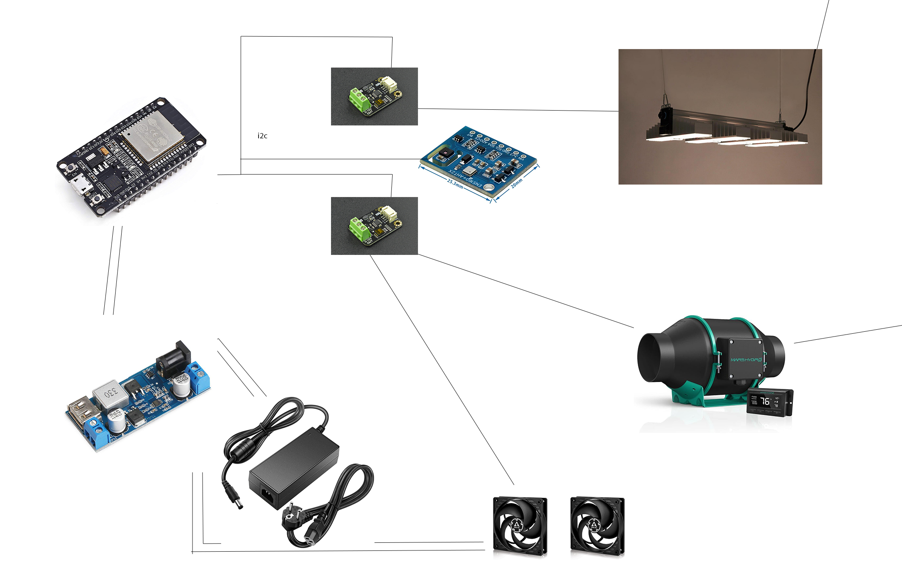
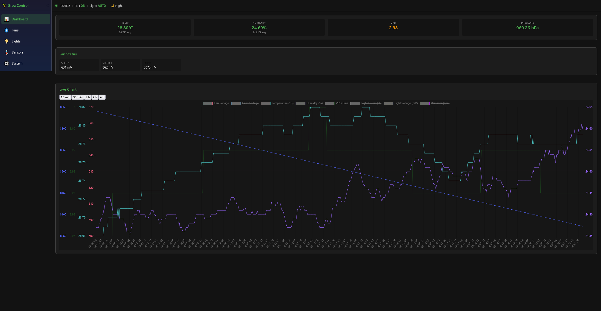
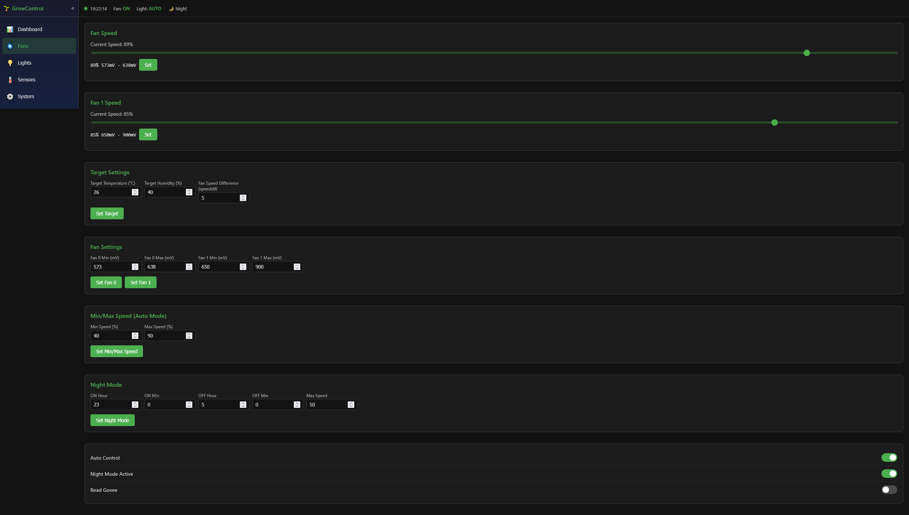
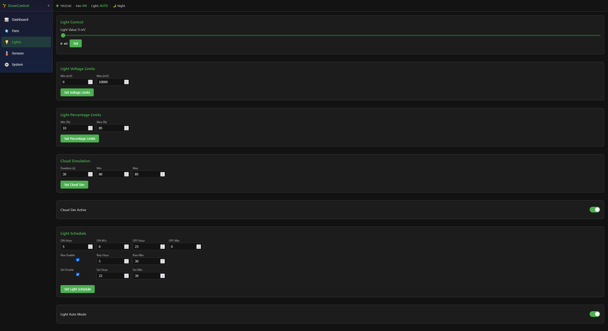
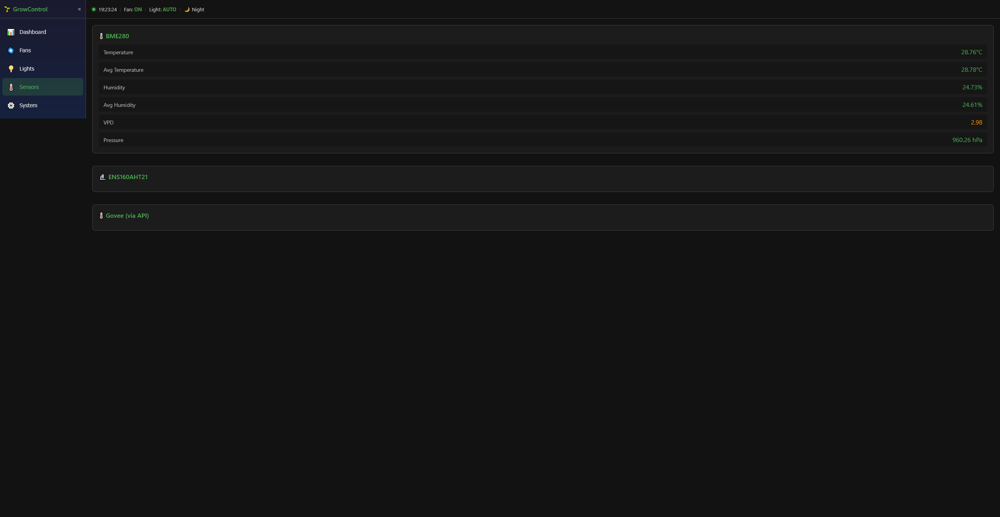
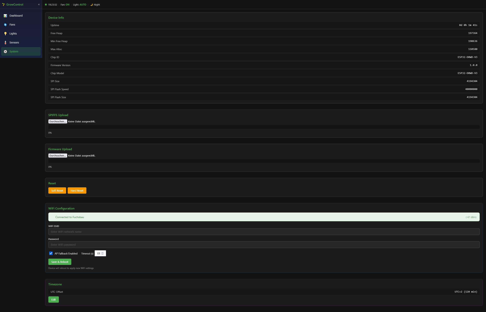

# GrowControl — ESP32 Smart Grow-Tent Controller



A feature-rich ESP32-based controller for managing grow-tent environments, including fan speed control, lighting automation, sensor monitoring, and real-time web dashboard.

---

## Overview

GrowControl uses an ESP32 microcontroller to monitor environmental conditions (temperature, humidity, pressure, CO₂) and automatically control ventilation fans and grow lights via a DFRobot GP8403 I²C DAC. A responsive Angular web interface provides real-time charts, device configuration, and OTA firmware/file-system updates.

---

## Hardware Requirements

| Component | Description |
|-----------|-------------|
| **ESP32** | 1x (any ESP32-WROOM module) |
| **I²C DAC** | Gravity 2-Channel I2C DAC Module (DFRobot GP8403) — converts I²C to 0–10V PWM signals for fans/lights |
| **SD Card Reader** | For environmental data logging (optional) |
| **Sensor** | **BME280** (temperature, humidity, pressure) **or** **ENS160 + AHT21** (temperature, humidity, CO₂, TVOC, air quality) |
| **Power** | 12V → 5V step-down regulator for the ESP32 |

### Pin Mapping

| Signal | GPIO |
|--------|------|
| I²C SDA | 21 |
| I²C SCL | 22 |
| SD Card CS | 5 |
| SD Card MOSI | 23 |
| SD Card SCK | 18 |
| SD Card MISO | 19 |

### DAC Module Wiring Notes

- Devices sharing the same power source as the ESP32 need **only the PWM signal wire** (no GND connection).
- Externally powered devices (e.g., 12V lamp, 24V fan) require a **GND connection** to the DAC.

---

## Features

### Fan Control
- Control **2 exhaust/blow fans** (in/out) independently via 0–10V PWM signals
- **Auto-mode**: Fans adjust speed based on temperature and humidity setpoints
- **Speed differential**: Fine-tune fan balance to maintain negative pressure in the tent
- **Night mode**: Schedule reduced fan speeds during specific time ranges
- Configurable min/max speed ranges and voltage limits per fan

### Light Control
- **Automatic on/off scheduling** with configurable sunrise/sunset ramps
- **Manual PWM control** (0–255) for direct light intensity adjustment
- **Cloud simulation mode**: Simulates natural light variation with configurable min/max intensity and cycle duration
- Voltage-based calibration for different light types

### Sensor Monitoring
- **BME280**: Temperature, humidity, pressure with averaging
- **ENS160 + AHT21**: Temperature, humidity, CO₂ (eCO₂), Air Quality Index (AQI), TVOC
- **VPD (Vapor Pressure Deficit)**: Calculated from sensor data for optimal growing conditions
- **Govee BTH5179** (optional): Bluetooth temperature/humidity/battery readings

### Data Logging
- SD-card logging (when enabled): Creates `/year/month/day/hour.csv` files
- Stores values every second: time, temperature, humidity, CO₂, light level, VPD
- Download historical CSV data via web interface

### Web Interface
- **Real-time dashboard** with live charts (Chart.js)
- WebSocket-based push updates (~1 Hz when clients connected)
- Fan configuration panel (speed, voltage limits, auto-mode, night mode)
- Light configuration panel (schedule, sunrise/sunset, cloud sim)
- Sensor data display (temperature, humidity, pressure, CO₂, AQI, TVOC)
- System info (uptime, heap memory, WiFi status, chip info)
- **OTA firmware update** via browser
- **SPIFFS filesystem update** via browser
- **WiFi configuration** page (SSID, password, AP fallback settings)
- **Timezone configuration** for accurate sunrise/sunset calculations

### Dashboard



### Fan Control



### Light Control



### Sensors



### System Settings



---

## Project Structure

```
GrowControl/
├── src/                          # ESP32 firmware (C++)
│   ├── main.cpp                  # Entry point, setup/loop
│   ├── FanController.cpp/h       # Fan speed & auto-control logic
│   ├── LightController.cpp/h     # Light scheduling & PWM control
│   ├── MyWebServer.cpp/h         # Async web server + WebSocket handlers
│   ├── WiFiManager.cpp/h         # WiFi connection + AP fallback + NVS storage
│   ├── MyPreferences.cpp/h       # NVS preferences (timezone, etc.)
│   ├── FileController.cpp/h      # SD card file I/O
│   ├── Bme280.cpp/h              # BME280 sensor driver
│   ├── Ens160Aht2x.cpp/h         # ENS160 + AHT21 sensor driver
│   ├── GoveeBTh5179.cpp/h        # Govee BTH5179 Bluetooth client
│   ├── Voltage.h                 # Voltage measurement utility
│   ├── MyTime.h                  # Time utility
│   └── MyPreferences.h           # NVS preferences interface
├── growui/                       # Angular frontend
│   ├── src/app/
│   │   ├── api.service.ts        # HTTP API client
│   │   ├── websocket.service.ts  # WebSocket client (rxjs)
│   │   ├── dashboard.service.ts  # Central state management
│   │   ├── types.ts              # TypeScript interfaces
│   │   ├── chart/                # Chart.js configuration
│   │   ├── features/
│   │   │   ├── dashboard/        # Main dashboard component
│   │   │   ├── fans/             # Fan control panel
│   │   │   ├── lights/           # Light control panel
│   │   │   ├── sensors/          # Sensor data display
│   │   │   └── system/           # System settings & OTA
│   │   └── shared/
│   │       ├── sidebar/          # Navigation sidebar
│   │       └── topbar/           # Top navigation bar
│   └── package.json              # Angular 21 + PrimeNG 21
├── platformio.ini                # Build configuration
├── custom_partition.csv          # Flash partition layout
├── data/                         # Static web assets served by ESP
└── README.md
```

---

## Build & Flash

### Prerequisites

- **[PlatformIO Core](https://platformio.org/install)** — `pip install platformio`
- USB cable for ESP32 connection

### Build Firmware

```bash
pio run -e esp32dev
```

This compiles the firmware and all library dependencies.

### Flash to ESP32

```bash
pio run --target upload -e esp32dev -f /dev/ttyUSB0   # Linux
pio run --target upload -e esp32dev -f COM5           # Windows
```

Or use the PlatformIO VS Code extension: **PlatformIO: Build** → **Upload**.

### Upload SPIFFS Image (optional)

```bash
pio run --target uploadfs -e esp32dev
```

Or via curl:

```bash
curl.exe -X POST http://<ESP_IP>/flashspiffs -F "file=@spiffs.bin"
```

---

## Build Flags & Configuration

All flags are defined in [`platformio.ini`](platformio.ini) under `build_flags`. Uncomment by removing the leading semicolon (`;`).

| Flag | Purpose |
|------|---------|
| `USE_SDCARD=1` | Enable SD-card logging (`/year/month/day/hour.csv`) |
| `SENSOR_BME280=1` | Use BME280 sensor (temperature, humidity, pressure) |
| `SENSOR_ENS160AHT21=1` | Use ENS160/AHT21 sensor (temperature, humidity, CO₂, AQI, TVOC) |
| `BME_I2C_ADD=119` | I²C address of BME280 (decimal) |
| `i2c_aht_addr=56` | I²C address of AHT21 (decimal) |
| `i2c_ens_add=83` | I²C address of ENS160 (decimal) |
| `I2C_SDA=21` | I²C SDA GPIO pin |
| `I2C_SCL=22` | I²C SCL GPIO pin |
| `i2c_pwn_addr=95` | I²C address of fan PWM controller (DFRobot GP8403) |
| `i2c_light_addr=94` | I²C address of light PWM controller (DFRobot GP8403) |
| `time_zone_hour_utc_offset=1` | UTC offset in hours for sunrise/sunset |
| `MYSSID=""` | Hardcoded WiFi SSID (fallback) |
| `PW=""` | Hardcoded WiFi password (fallback) |
| `http_port=80` | HTTP server port |
| `GOVEE_BTH5179=1` | Enable Govee BTH5179 Bluetooth sensor support |
| `FIRMWARE_VERSION="1.0.0"` | Firmware version string |

### Sensor Selection

Only **one** sensor type should be enabled at a time:

```ini
; Option 1: BME280 (recommended for most setups)
-DSENSOR_BME280=1
-DBME_I2C_ADD=119

; Option 2: ENS160 + AHT21 (for CO₂ monitoring)
-DSENSOR_ENS160AHT21=1
-Di2c_ens_add=83
-Di2c_aht_addr=56
```

---

## Frontend Development

The Angular web interface (`growui/`) runs as a separate dev server and proxies API requests to the ESP32.

### Setup

```bash
cd growui
npm install
```

### Configure API Base URL

Edit [`growui/src/environments/environment.ts`](growui/src/environments/environment.ts):

```typescript
export const environment = {
  production: false,
  apiBaseUrl: 'http://<ESP_IP>',
  apiPort: 80,
};
```

### Run Dev Server

```bash
npm start   # serves on http://localhost:4200
```

### Build for Production

```bash
npm run build
```

The built files should be placed in the `data/` directory and uploaded as SPIFFS.

---

## ESP32 Web API

### HTTP Endpoints

| Endpoint | Method | Description |
|----------|--------|-------------|
| `/settings` | GET | Get all device configuration and state |
| `/cmd` | GET | Execute command (query params: `var`, `id`, `val`, etc.) |
| `/data` | GET | Get logged CSV data (params: `year`, `month`, `day`, `hour`) |
| `/ws` | WebSocket | Real-time push updates (~1 Hz) |
| `/flashfirmware` | POST | OTA firmware update (multipart form) |
| `/flashspiffs` | POST | OTA SPIFFS filesystem update (multipart form) |
| `/wifi-config` | POST | Update WiFi credentials |

### Command Variables (`/cmd?var=...`)

| `var` | Parameters | Description |
|-------|-----------|-------------|
| `speed` | `id` (0/1), `val` (0–100) | Set fan speed percentage |
| `lightval` | `val` (0–255) | Set light PWM value |
| `voltage` | `id`, `min`, `max` | Set fan voltage calibration limits |
| `autospeed` | `min`, `max` | Set auto-mode min/max fan speed |
| `autovals` | `temp`, `hum`, `speeddif` | Set target temperature, humidity, filter compensation |
| `temphumdif` | `temp`, `hum` | Set temperature/humidity differential |
| `autocontrol` | `val` (0/1) | Enable/disable fan auto-control |
| `fannightmode` | `onh`, `onm`, `offh`, `offm`, `mspeed` | Set night mode schedule |
| `fannightmodeactive` | `val` (0/1) | Enable/disable night mode |
| `lightautomode` | `enable` (0/1) | Enable/disable light auto mode |
| `lightsettime` | `onh`, `onmin`, `offh`, `offmin`, `riseh`, `risemin`, `seth`, `setmin`, `riseenable`, `setenable` | Set light schedule |
| `lightvoltage` | `min`, `max` | Set light voltage limits |
| `lightlimitsp` | `min`, `max` | Set light percentage limits |
| `cloudsim` | `cloudduration`, `min`, `max` | Configure cloud simulation |
| `cloudsimactive` | `val` (0/1) | Enable/disable cloud simulation |
| `readgovee` | `val` (0/1) | Enable/disable Govee sensor reading |
| `timezone` | `action=get/set`, `offset` | Get/set timezone offset |

### WebSocket Message Format

The server pushes JSON messages every second when clients are connected:

```json
{
  "bme280": {
    "temperatur": "21.72",
    "humidity": "33.12",
    "atemperatur": "21.75",
    "ahumidity": "33.15",
    "pressure": "952.54",
    "apressure": "952.56",
    "vpd": "1.74"
  },
  "voltage0": 573,
  "voltage1": 671,
  "nightmode": false,
  "time": "14:08:45",
  "lightvalP": 0,
  "lightvalmv": 0,
  "lightstate": 0,
  "vpdair": "1.74",
  "autocontrolspeed": 50
}
```

---

## System Architecture

```
┌──────────────────────────────────────────────────────────────┐
│                      ESP32                                    │
│                                                               │
│  ┌──────────┐  ┌──────────┐  ┌──────────┐  ┌────────────┐  │
│  │WiFiMgr   │  │WebServer │  │  WS      │  │Preferences │  │
│  │(NVS)     │  │(Async)   │  │  (Push)  │  │(NVS)       │  │
│  └────┬─────┘  └────┬─────┘  └────┬─────┘  └─────┬──────┘  │
│       │              │             │               │         │
│  ┌────┴──────────────┴─────────────┴───────────────┴──────┐ │
│  │                    MyWebServer                          │ │
│  └────────────────────────┬────────────────────────────────┘ │
│                           │                                   │
│  ┌──────────┐  ┌──────────┐  ┌──────────┐                   │
│  │FanCtrl   │  │LightCtrl │  │Sensors   │                   │
│  │(GP8403)  │  │(PWM)     │  │(BME280/  │                   │
│  └─────┬────┘  └─────┬────┘  │ENS160)   │                   │
│        │              │       └──────────┘                   │
│        │              │                                      │
│  ┌─────┴──────────────┴──────────────┐                      │
│  │      DFRobot GP8403 DAC           │                      │
│  │   Channel 0 → Fan 0 (0-10V)       │                      │
│  │   Channel 1 → Fan 1 (0-10V)       │                      │
│  │   Channel 2 → Light (0-10V)       │                      │
│  └───────────────────────────────────┘                      │
│                                                               │
└──────────────────────────────────────────────────────────────┘
         │
         │  HTTP + WebSocket
         ▼
┌──────────────────────────────────────┐
│     Angular Web Dashboard (Browser)   │
│   ┌─────────┐ ┌──────┐ ┌──────────┐  │
│   │Dashboard│ │Fans  │ │Lights    │  │
│   │+Charts  │ │Ctrl  │ │Ctrl      │  │
│   └─────────┘ └──────┘ └──────────┘  │
└──────────────────────────────────────┘
```

---

## Firmware Version

Current version: **1.0.0** (configurable via `FIRMWARE_VERSION` build flag)

---

## License

This project is provided as-is for personal use in grow-tent automation.
